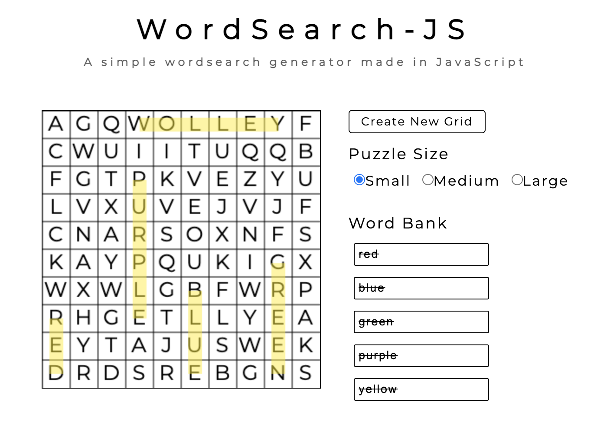

# WordSearch-JS

WordSearch-JS is a simple word search generator made in Javascript along with the Canvas API.
Select the grid size, fill out the word bank and click "Create New Grid" to generate a random puzzle.
Click and drag to a word to highlight it.

## How does it work?
First, words that are given to the word bank are stored into an array.  Upon creating a new grid, the array is sorted by word length with the longer words in the front and the shorter words in the back.  This ensures that the larger words are placed onto the grid first.

Words are taken from the array starting from the head.  The following is done in order to place the word:

1. Grab the first letter of the word and choose a random spot on the grid.
2. Choose a random direction and check if all positions in that direction are free using the total length of the word.
3. If the position is free, place each letter on the grid in the given direction.  If not, repeat step 1.
4. Repeat each step until all words are placed.

It is possible that the words given may never fit on the grid due to word length or a limited amount of room.  To prevent these problems we can limit the amount of characters a word can have by the maximum size of the grid.  This limit does not prevent other issues from occuring though.  It's still possible for the generator to be unable to fit words on the grid.  This may cause an infinite loop where the generator struggles to find a position to place a word.  To fix this, the generator will only loop through the algorithm a limited number of times before giving up.  An alert will appear informing the user about the problem.

## Demo
Try the [demo](https://dkihe.github.io/wordsearch-js/) 

**NOTE:**
The current implementation of the application does not work on tablets or phones.
